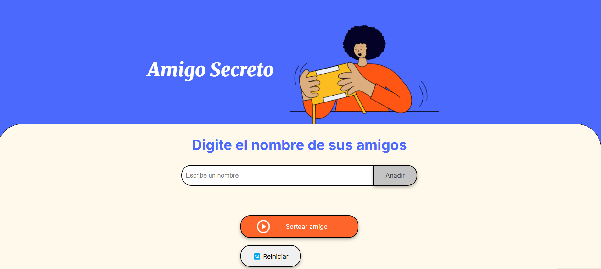
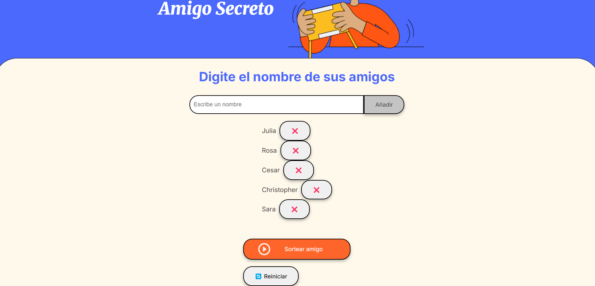
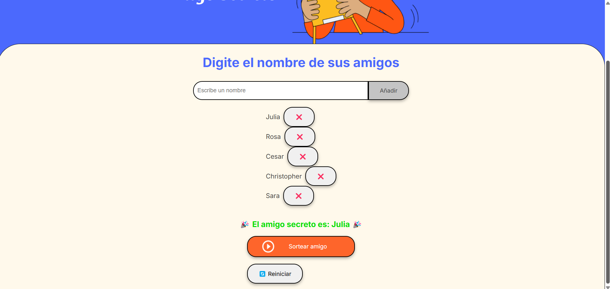

# 🎁 Amigo Secreto

¡Bienvenido al juego de Amigo Secreto! 🎉 Este proyecto permite agregar nombres de amigos, realizar un sorteo y descubrir quién será el amigo secreto de cada participante.

## 🚀 Características
- Agregar nombres de amigos a la lista.
- Eliminar nombres si es necesario presionando "❌" junto a cada nombre.
- Sortear un amigo secreto de manera aleatoria.
- Animaciones y efectos visuales para una mejor experiencia.
- Opción de reiniciar la lista y realizar un nuevo sorteo.

## 📜 Requisitos
Este juego funciona en cualquier navegador moderno con soporte para JavaScript, HTML y CSS.

## 📌 Instrucciones de Uso
1. Ingresa el nombre de cada amigo en el campo de texto y presiona "Añadir".
2. Una vez agregados los participantes, presiona "Sortear Amigo".
3. Si deseas eliminar un nombre, presiona el botón "❌" junto al nombre en la lista.
4. Se mostrará el resultado con el nombre del amigo secreto.
5. Si deseas empezar de nuevo, usa el botón "Reiniciar".

## 🛠️ Tecnologías Utilizadas
- **HTML**: Estructura del juego.
- **CSS**: Estilos y animaciones.
- **JavaScript**: Lógica del juego y sorteos aleatorios.

## 📷 Captura de Pantalla

## 📜 Licencia
Este proyecto es de código abierto y puede ser modificado o distribuido libremente.

¡Diviértete jugando Amigo Secreto! 🎊
